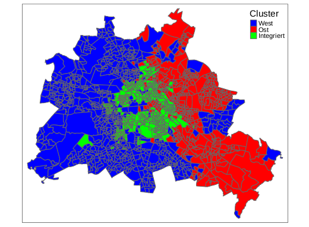

# voting_patterns

Voting data sets are a convenient platform for data science analysis for several reasons: they are quantifiable measurements of human social psychology, and they exhibit the right balance of noise as well as intuitive trends. In Germany, in particular, the compulsory `Wohnmeldungs' allow for very detailed information in each riding. Moreover, in Berlin (as well as at the national level), East/West divide provides a prominent feature for binary classification.

The results shown in [this report](Writeup/Berlin_report.pdf) represent the results of playing with this data a bit.

 

